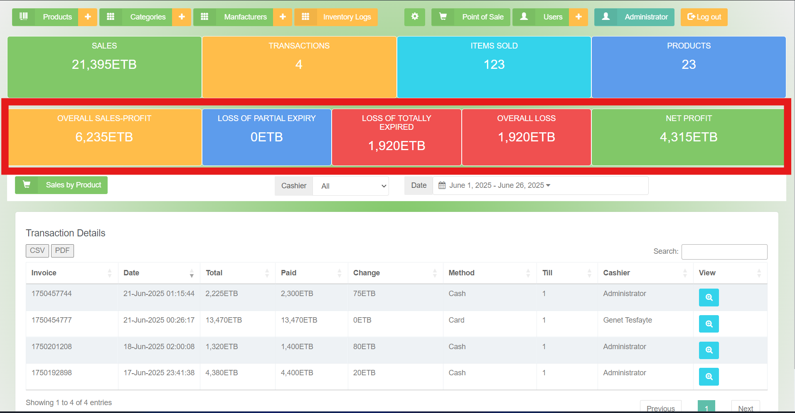
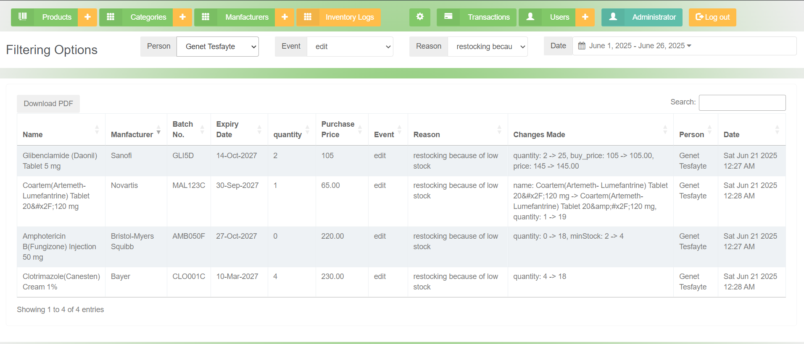

# 💊 Improved POS System – Feature Enhancements and Code Customizations

This repository documents core improvements I made to an existing Pharmacy POS system originally built with **Node.js**, **jQuery**, and **NeDB**. The base system lacked advanced business features. I introduced key upgrades in the following areas:

---

## 1. 📈 Profit/Loss Calculation Enhancements

**Original Limitation:**  
- The system only showed total sales and number of items sold.

**What I Added:**  
- Dynamic **monthly profit/loss calculation**
- **Breakdown of losses** from:
  - Partially expired items
  - Totally expired and unsold items
- Net profit display for each reporting period

**Modified File:**  
- `pos.js`

---

## 2. 🔍 Product Traceability (Duplicate Prevention)

**Original Limitation:**  
- Products were identified only by name and barcode.
- Duplicate entries were common (same name/batch).

**What I Added:**  
- Introduced **manufacturer** and **batch number** to product uniqueness.
- Prevented products with same name, batch, and manufacturer from being added.
- Enhanced filtering by category, batch, and manufacturer in POS view.

**Created/Modified Files:**  
- `manufacturer.js` (new API)
- `inventory.js`, `pos.js`

---

## 3. 🧾 Inventory Logging System

**Original Limitation:**  
- No history or audit log when editing or deleting product records.

**What I Added:**  
- **Inventory Log Table**: Captures original product data before change
- Tracks:
  - What was changed or deleted
  - When the change happened (timestamp)
  - Who made the change (user)
  - Why the change was made (reason entry)
- Helps with audit, loss tracking, and accountability

**Modified Files:**  
- `inventory.js`
- Database integration for log collection

---

## 🖼 Screenshots

| Feature | Screenshot |
|--------|------------|
| Profit/Loss Report |  |
| Inventory Logging UI |  |

---

## 📁 Folder Description

| Folder | Purpose |
|--------|---------|
| `modified/` | Contains updated source files |
| `original-snippets/` | (Optional) Partial code before enhancement for comparison |
| `screenshots/` | UI changes or logs from the POS interface |

---

## 💡 Technologies Used
- Node.js
- NeDB (local database)
- jQuery (frontend interaction)
- HTML/CSS (POS UI)
- Custom REST APIs

---

## 🧑‍💻 Author

**Wadola Habte**  
IT Professional & Instructor

---

## 📜 License

This repo is for educational and demonstration purposes only. It does not include the full POS source code for licensing reasons.
