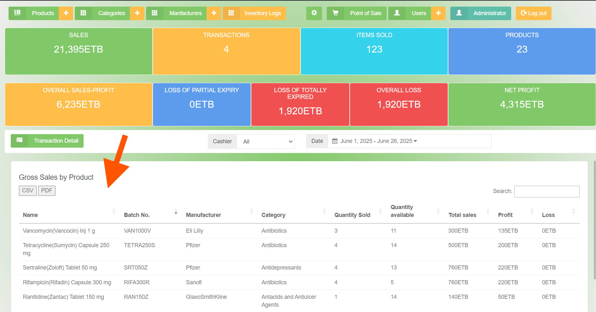

# 💊 Improved Pharmacy POS System

An enhanced Point of Sale (POS) system designed for **pharmacies and drug stores**, built on top of an existing Node.js + jQuery + NeDB stack. This version introduces **professional-grade business features**, including financial tracking, inventory accountability, and traceability — features often missing from basic POS software.

---

## 🚀 Features Overview

### 📈 Profit/Loss Reporting
- Monthly profit and loss breakdown
- Calculates and displays:
  - ✅ Net profit
  - 🟡 Partial expiry loss
  - 🔴 Full expiry loss
- Visual reports (charts and graphs-ready structure)

### 🔍 Product Traceability
- Prevents duplicate product entries using:
  - Product Name
  - Manufacturer
  - Batch Number
- Enhanced filters: Category, Manufacturer, Batch

### 🧾 Inventory Logging System (Audit Trail)
- Logs every **product edit or deletion**
- Captures:
  - What changed
  - Who made the change
  - When it happened
  - Reason for the change

---

## 📂 Project Structure

| Folder | Description |
|--------|-------------|
| `modified/` | Enhanced source files with improvements |
| `original-snippets/` | Partial code snippets from the original POS |
| `screenshots/` | UI screenshots of new features |

---

## 🖼 Screenshots

| Feature | Screenshot |
|--------|------------|
| Profit/Loss Report |  |
| Inventory Log UI |  |
| Product Filter View |  |

---

## ⚙️ Technologies Used

- **Node.js** – Backend runtime
- **NeDB** – Lightweight local database
- **jQuery** – Frontend interactivity
- **HTML/CSS** – POS user interface
- **Custom REST APIs** – Modular endpoint logic

---

## 🧪 Quick Start

> ⚠️ This repo contains partial logic and structure. A full production deployment requires POS base code and environment setup.

```bash
git clone https://github.com/wadhab7/Improved-POS-system.git
cd Improved-POS-system
npm install
node server.js
# 💊 Improved Pharmacy POS System

A professionally enhanced Point of Sale (POS) system tailored for pharmacies and drug stores. Built on Node.js, jQuery, and NeDB, this system introduces real business-critical features such as traceable inventory control, monthly profit/loss reporting, and user accountability — beyond the limitations of basic POS tools.

---

## 🌟 Key Features

### 📈 Monthly Profit/Loss Analysis
- Tracks net profit by month
- Breaks down losses into:
  - Partial expiry loss
  - Total expiry loss
- Suitable for trend visualization (line, bar, pie)

### 🔍 Product Traceability
- Prevents duplicate entries using:
  - Product name
  - Manufacturer
  - Batch number
- Advanced filters by category, manufacturer, and batch

### 🧾 Inventory Audit Logging
- Logs every edit or deletion of inventory records
- Captures:
  - What changed
  - When it changed (timestamp)
  - Who made the change (user)
  - Why the change was made (reason field)
- Enables audit trails and accountability

---

## 🗂️ Folder Overview

| Folder | Purpose |
|--------|---------|
| `modified/` | Enhanced/rewritten files |
| `original-snippets/` | Snippets from original codebase (for reference) |
| `screenshots/` | UI feature previews |

---

## 🖼️ Screenshots

| Feature | Preview |
|--------|---------|
| Profit/Loss Report |  |
| Inventory Log UI |  |
| Product Filtering |  |

---

## ⚙️ Tech Stack

- **Backend:** Node.js (## 👨‍💻 Author

**Wadola Habte**  
IT Professional & Instructor  
GitHub: [@wadhab7](https://github.com/wadhab7)-style logic)
- **Database:** NeDB (lightweight JSON-based DB)
- **Frontend:** jQuery, HTML, CSS
- **Integration:** RESTful custom APIs

---

## 🔧 Quick Start

```bash
git clone https://github.com/wadhab7/Improved-POS-system.git
cd Improved-POS-system
npm install
node server.js

## 👨‍💻 Author

**Wadola Habte**  
IT Professional & Instructor  
GitHub: [@wadhab7](https://github.com/wadhab7)
Email: wadolahabte7@gmail.com
